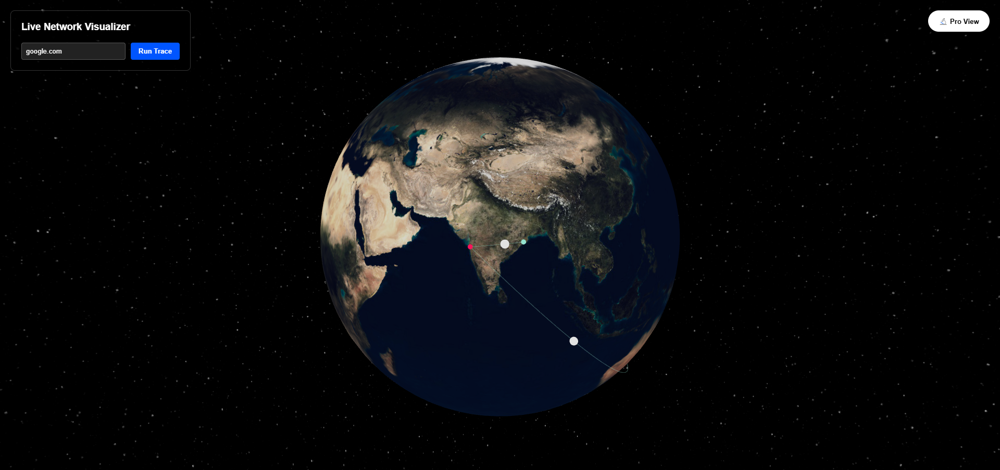
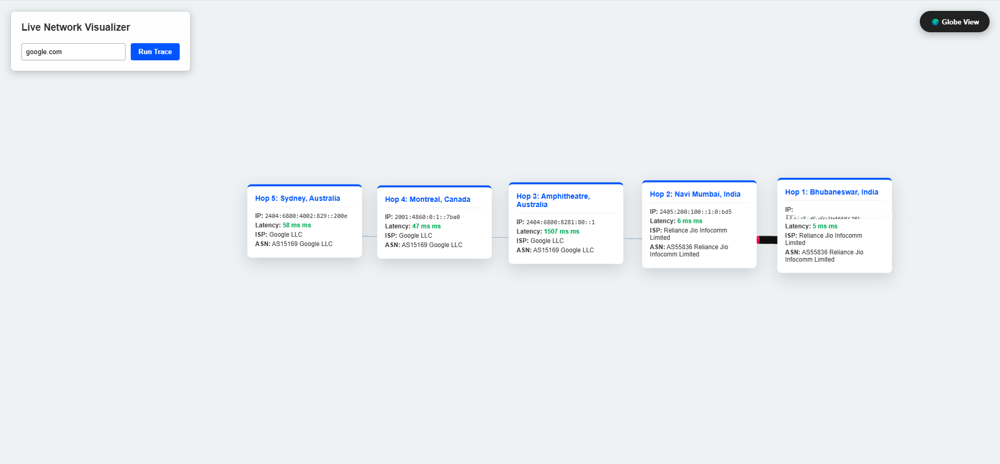

# 🌐 Life of a Packet: 3D Network Visualizer

An immersive, full-stack 3D network diagnostic tool that visualizes the physical path of internet packets across the globe in real-time. Built with **React**, **Three.js**, and **Node.js**.

---

## 🚀 Overview

**Life of a Packet** transforms the abstract process of a network `traceroute` into a cinematic 3D experience. It maps every router hop between your local machine and a target domain, identifying physical locations, ISPs, and latency bottlenecks.

### 🔬 Two Distinct Modes:
* **🌍 Globe View**: A high-fidelity, interactive 3D Earth showing glowing arcs and packet movements across continents.
* **🔬 Pro View**: A "laboratory" mode where hops are laid out linearly. A custom 3D rocket navigates the path, triggering data cards for **IP, ISP, Org, ASN, and Latency (ms)**.

---

## 🛠️ Tech Stack

### Frontend
- **React.js**: UI Component Architecture.
- **Three.js / React Three Fiber**: High-performance 3D rendering and animation.
- **Drei**: Helper components for 3D UI and camera controls.

### Backend
- **Node.js & Express**: API handling and routing.
- **Axios**: Geospatial and external API communication.
- **Network Logic**: Optimized for Windows 11 `tracert` and cloud-based traceroute APIs.

---
